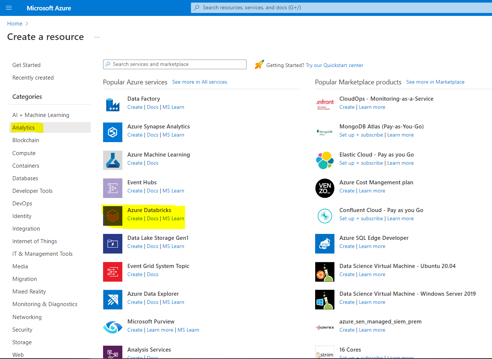
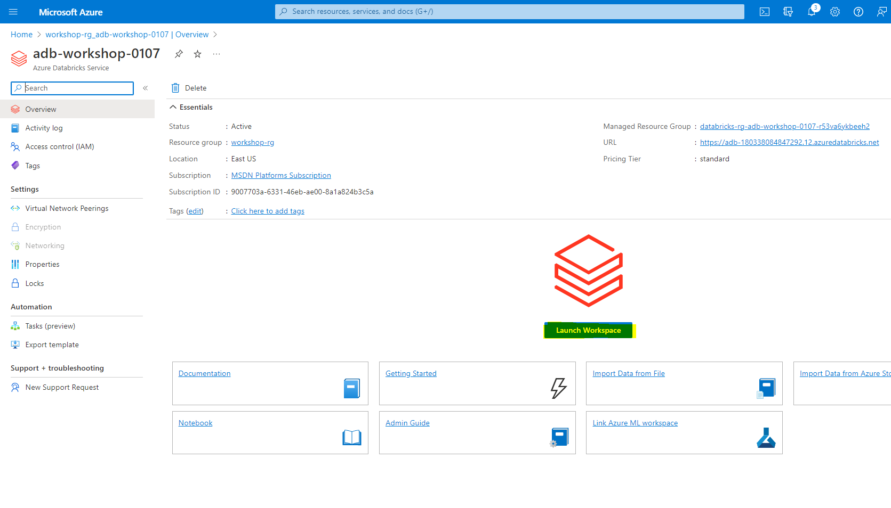

# Run a Databricks notebook with the Databricks Notebook Activity in Azure Data Factory


In this Workshop, you use the Azure portal to create an Azure Data Factory pipeline that executes a Databricks notebook against the Databricks jobs cluster. It also passes Azure Data Factory parameters to the Databricks notebook during execution.

You perform the following steps in this tutorial:

  - Create a data factory.

  - Create a pipeline that uses Databricks Notebook Activity.

  - Trigger a pipeline run.

  - Monitor the pipeline run.

If you don't have an Azure subscription, create a [free account](https://azure.microsoft.com/free/) before you begin.


  - **Azure Databricks workspace**. [Create a Databricks workspace](/azure/databricks/scenarios/quickstart-create-databricks-workspace-portal) or use an existing one. You create a Python notebook in your Azure Databricks workspace. Then you execute the notebook and pass parameters to it using Azure Data Factory.

## Create a data factory

1. Launch **Microsoft Edge** or **Google Chrome** web browser. Currently, Data Factory UI is supported only in Microsoft Edge and Google Chrome web browsers.

1. Select **Create a resource** on the Azure portal menu, select **Integration**, and then select **Data Factory**.


   

1. On the **Create Data Factory** page, under **Basics** tab, select your Azure **Subscription** in which you want to create the data factory.

1. For **Resource Group**, take one of the following steps:
    
    1. Select an existing resource group from the drop-down list.
    
    1. Select **Create new**, and enter the name of a new resource group.


1. For **Region**, select the location for the data factory.

    The list shows only locations that Data Factory supports, and where your Azure Data Factory meta data will be stored. The associated data stores (like Azure Storage and Azure SQL Database) and computes (like Azure HDInsight) that Data Factory uses can run in other regions.

1. For **Name**, enter **ADFTutorialDataFactory**.
    
    The name of the Azure data factory must be *globally unique*. If you see the following error, change the name of the data factory (For example, use **&lt;yourname&gt;ADFTutorialDataFactory**). 


1. For **Version**, select **V2**.

1. Select **Next: Git configuration**, and then select **Configure Git later** check box.

1. Select **Review + create**, and select **Create** after the validation is passed. 

1. After the creation is complete, select **Go to resource** to navigate to the **Data Factory** page. Select the **Open Azure Data Factory Studio** tile to start the Azure Data Factory user interface (UI) application on a separate browser tab.


## Create Azure Databricks

In this section, You are going to create a Azure Databricks service from Azure portal.






## Create linked services

In this section, you author a Databricks linked service. This linked service contains the connection information to the Databricks cluster:

### Create an Azure Databricks linked service

1.  On the home page, switch to the **Manage** tab in the left panel.


1.  Select **Linked services** under **Connections**, and then select **+ New**.
    


1.  In the **New linked service** window, select **Compute** &gt; **Azure Databricks**, and then select **Continue**.
    


1.  In the **New linked service** window, complete the following steps:
    
    1.  For **Name**, enter ***AzureDatabricks\_LinkedService***.
    
    1.  Select the appropriate **Databricks workspace** that you will run your notebook in.

    1.  For **Select cluster**, select **New job cluster**.
    
    1.  For **Databrick Workspace URL**, the information should be auto-populated.

    1.  For **Access Token**, generate it from Azure Databricks workplace. You can find the steps [here](https://docs.databricks.com/api/latest/authentication.html#generate-token).

    1.  For **Cluster version**, select the version you want to use.

    1.  For **Cluster node type**, select **Standard\_D3\_v2** under **General Purpose (HDD)** category for this tutorial. 
    
    1.  For **Workers**, enter **2**.
    
    1.  Select **Create**.


## Create a pipeline

1.  Select the **+** (plus) button, and then select **Pipeline** on the menu.


1.  Create a **parameter** to be used in the **Pipeline**. Later you pass this parameter to the Databricks Notebook Activity. In the empty pipeline, select the **Parameters** tab, then select **+ New** and name it as '**name**'.


1.  In the **Activities** toolbox, expand **Databricks**. Drag the **Notebook** activity from the **Activities** toolbox to the pipeline designer surface.


1.  In the properties for the **Databricks** **Notebook** activity window at the bottom, complete the following steps:

    1. Switch to the **Azure Databricks** tab.

    1. Select **AzureDatabricks\_LinkedService** (which you created in the previous procedure).

    1. Switch to the **Settings** tab.

    1. Browse to select a Databricks **Notebook path**. Let’s create a notebook and specify the path here. You get the Notebook Path by following the next few steps.

       1. Launch your Azure Databricks Workspace.

       1. Create a **New Folder** in Workplace and call it as **adftutorial**.

             
    

       1. [Screenshot showing how to create a new notebook.](https://docs.databricks.com/user-guide/notebooks/index.html#creating-a-notebook) (Python), let’s call it **mynotebook** under **adftutorial** Folder, click **Create.**

           


          

       1. In the newly created notebook "mynotebook'" add the following code:

           ```
           # Creating widgets for leveraging parameters, and printing the parameters
           dbutils.widgets.text("input", "","")
           y = dbutils.widgets.get("input")
           print ("Param -\'input':")
           print (y)
           ```

       The **Notebook Path** in this case is **/adftutorial/mynotebook**.


1.  Switch back to the **Data Factory UI authoring tool**. Navigate to **Settings** Tab under the **Notebook1** activity.

    a.  Add a **parameter** to the Notebook activity. You use the same parameter that you added earlier to the **Pipeline**.


    b.  Name the parameter as **input** and provide the value as expression **\@pipeline().parameters.name**.

1.  To validate the pipeline, select the **Validate** button on the toolbar. To close the validation window, select the **Close** button.


1.  Select **Publish all**. The Data Factory UI publishes entities (linked services and pipeline) to the Azure Data Factory service.


## Trigger a pipeline run

Select **Add trigger** on the toolbar, and then select **Trigger now**.


The **Pipeline run** dialog box asks for the **name** parameter. Use **/path/filename** as the parameter here. Select **OK**.


## Monitor the pipeline run

1.  Switch to the **Monitor** tab. Confirm that you see a pipeline run. It takes approximately 5-8 minutes to create a Databricks job cluster, where the notebook is executed.


1.  Select **Refresh** periodically to check the status of the pipeline run.

1.  To see activity runs associated with the pipeline run, select **pipeline1** link in the **Pipeline name** column.

1. In the **Activity runs** page, select **Output** in the **Activity name** column to view the output of each activity, and you can find the link to Databricks logs in the **Output** pane for more detailed Spark logs.

1. You can switch back to the pipeline runs view by selecting the **All pipeline runs** link in the breadcrumb menu at the top.

## Verify the output

You can log on to the **Azure Databricks workspace**, go to **Clusters** and you can see the **Job** status as *pending execution, running, or terminated*.


You can click on the **Job name** and navigate to see further details. On successful run, you can validate the parameters passed and the output of the Python notebook.


## Next steps

The pipeline in this sample triggers a Databricks Notebook activity and passes a parameter to it. You learned how to:

  - Create a data factory.

  - Create a pipeline that uses a Databricks Notebook activity.

  - Trigger a pipeline run.

  - Monitor the pipeline run.
